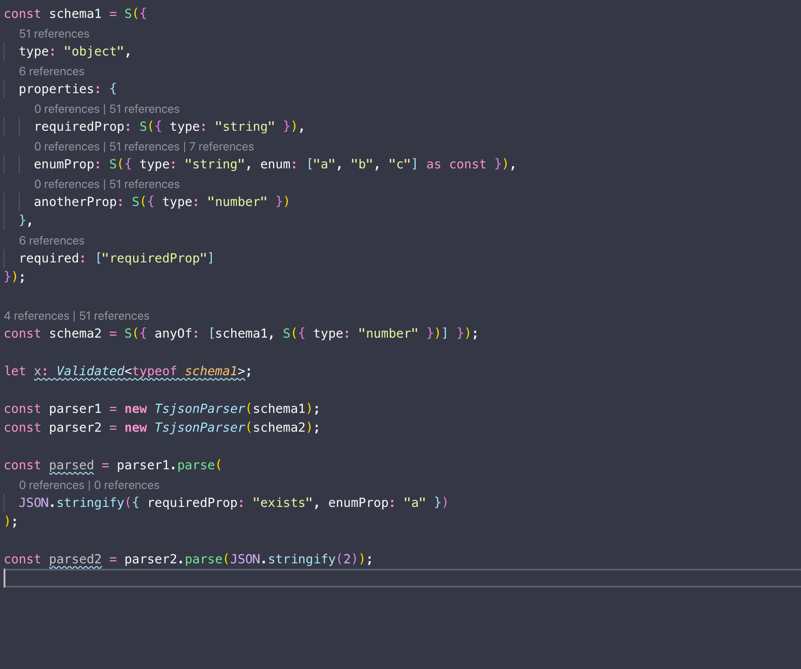

ts-json-validator
------

[](https://codecov.io/gh/ostrowr/ts-json-validator) [](https://github.com/prettier/prettier)  

Let JSON play nicely with Typescript.

### ⚠️ Warning: This project uses some features from Typescript 3.7, which is not yet officially released.

## Type once, check all the time



Naturally, all of the code you write is typed perfectly. But you're not in charge of all that pesky data that
comes from other places.

`JSON.parse` returns type `any`, which mangles all of your hard-earned strictness.

JSON validators are great, but they usually require you to define two things: the validation function and the
Typescript type to go along with it. These can get out of sync and are generally a pain to maintain. JSON schema is
a terrific idea, but the schemas are often tricky to write and even trickier to understand.

`ts-json-validator` allows you to define everything in one place. It generates a compliant JSON schema, a Typescript type
that matches objects that can be parsed by that schema, and provides a typesafe `parse` that throws if the JSON you get
doesn't match the type you're expecting.

This project uses [ajv](https://github.com/epoberezkin/ajv) under the hood for fast JSON validation against a schema. If
you don't want to validate every time, but still want a way to define a JSON schema that you can use as a Typescript
type, that's OK too.

`ts-json-validator` exposes a pretty small API. It allows you to create and validate against a schema compliant with
[draft-07 of JSON Schema](http://json-schema.org/draft-07/schema#) that also exposes a strict Typescript type expressing
the types assignable to the schema. `ts-json-validator` implements part, but not (yet) all, of [draft-07 of JSON Schema](http://json-schema.org/draft-07/schema#).

## Usage
First, import the important stuff:

`import { Schema, TsjsonParser, Validate } from "ts-json-validator"`

Then define a schema. Right now, `ts-json-validator` supports schemas typed as

- `string`
- `number`
- `integer`
- `boolean`
- `object`
- `array`
- `null`

and any combination thereof.

It also supports schemas that are combinations of other schemas, using the
`allOf` and `anyOf` directives. It doesn't yet support `oneOf`, since typing an XOR is a task for another day.

Let's say we want to define a schema that accepts objects with fields "a", "b", and "c".
A is a required string, b is an optional number, and c is an optional string that can only take on the values "B1" or "B2".

```
// Make a parser that accepts objects with fields "a", "b", and "c"
const parser = new TsjsonParser(
  Schema.Object({
    properties: {
      a: Schema.String({ title: "This is field A" }),
      b: Schema.Number(),
      c: Schema.String({ enum: ["B1", "B2"] as const })
    },

    required: ["a"] // possible fields autocomplete here
  })
);
```

You can see the generated schema:

```
JSON.stringify(parser.schema)
/*
{
  "type": "object",
  "properties": {
    "a": {
      "type": "string",
      "title": "This is field A"
    },
    "b": {
      "type": "number"
    },
    "c": {
      "type": "string",
      "enum": [
        "B1",
        "B2"
      ]
    }
  },
  "required": [
    "a"
  ]
}
*/
```

Or parse some string:

```
const stringToParse = JSON.stringify({ a: "Value for field A" });

const parsed = parser.parse(stringToParse);
/* parsed is of type
{
  a: string,
  b?: number,
  c?: "B1" | "B2"
}*/

console.log(parsed)
// { a: 'Value for field A' }
```

If you parse a string that doesn't match the schema and so can't be assigned to the expected type, it throws
```
const stringToParse = JSON.stringify({ a: "Value for field A", c: "Invalid" });

const parsed = parser.parse(stringToParse);
// throws
// Error: [{"keyword":"enum","dataPath":".c","schemaPath":"#/properties/c/enum","params":{"allowedValues":["B1","B2"]},"message":"should be equal to one of the allowed values"}]
```

You can skip validation, of course, but this is dangerous if you don't control the input:
```
const parsed = parser.parse(stringToParse, true);
// no validation; parsed might be the wrong type here.
```

If you just want to validate an object against the schema, but have no need to parse it, run

`parser.validate(obj)`

This is a typescript assertion function (introduced in 3.7) that will either throw or narrow the type of `obj`
in the rest of the scope.

If you have a schema and want to use its type in helper functions, there is a helper type `Validated<T>`
such that `Validated<typeof schema>` is the type defining all types that are assignable to this `schema`.

See the tests for more examples.

## Installation
`npm i ts-json-validator`

## How does all this work?
The object built up has the structure of a valid JSON schema with one extra magic feature: a hidden symbol that every
schema uses to hold its own type.

## Contributing
Please do!
